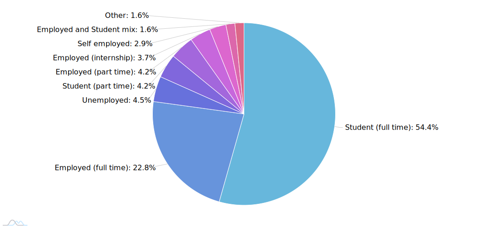
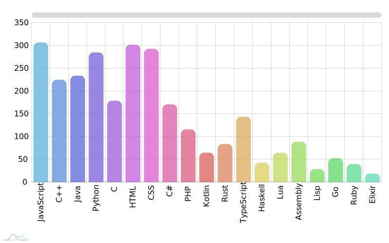
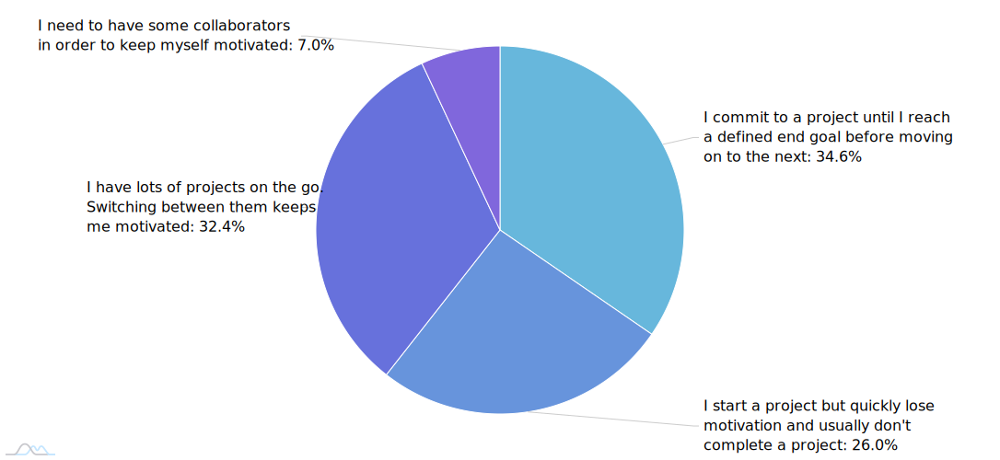

# The Programmer's Hangout 2021 Survey Report

This report details the condensed results of The Programmer's Hangout 2021 Survey. We'll take a look at the most interesting and obscure answers our members submitted.

[The data can be found here as a tab separated file.](https://github.com/the-programmers-hangout/Surveys/tree/master/data/2021)

## Contents

- [About You](#about-you)
- [Education & Employment](#education-&-employment)
- [Programming](#programming)
- [Open Source](#open-source)
- [TPH Feedback](#tph-feedback)

## Submission timeline

This is a graph of submission times. These have been omitted from the data. The initial spike came the day after the initial survey announcement as it was posted rather late in the day (~midight CET). The second spike on February 18th comes from the Active role ping in the active channel.

Source: https://codepen.io/itshobbes/pen/JjbzPMq

## About you

### Where are you from?

Source: https://codepen.io/itshobbes/pen/bGBgvoM

### How old are you?

https://codepen.io/itshobbes/pen/YzpOrLL

### What age did you start programming?

https://codepen.io/itshobbes/pen/JjbaMjq

## Education & Employment

### What is your current employment status?

https://codepen.io/itshobbes/pen/GRNXyJq

### Do you code outside of work/studying?

https://codepen.io/itshobbes/pen/oNYPpxN

### What is the highest level of education you have completed?

https://codepen.io/itshobbes/pen/xxRjVmM

### What do you value most in a job?

https://codepen.io/itshobbes/pen/bGBxoYJ

## Programming

### What motivates you to programming?

For the purposes of protecting people's privacy we have redacted the raw reasons provided.

As a summary, some of the most common reasons are listed below.

* Self improvement
* Fun
* To make life easier (automation)
* Money
* Being creative
* Problem solving

### Which language(s) have you worked with in your studies, during employment, or at home?

https://codepen.io/itshobbes/pen/mdOGpMR

### Which language(s) would you say you are most proficient in?

https://codepen.io/itshobbes/pen/eYBLyEx

### What is your favourite language and why?

Below is an ordered list of TPH's favourite language's alongside the more common reasons that showed up. Languages with fewer than 5 mentions are not shown in this list.

| Language | Count | Reasons |
| --- | --- | --- |
|**Python** | 63 | Simplicity, Easy to pick up, large community|
|**JavaScript** | 59 | Versatility, easy to understand, forgiving|
|**C++** | 42 | Flexibility and low level interaction, fast|
|**Java** | 41 | WORA, job security|
|**TypeScript** | 32 | Type checking, easy to start with, improvement over javascript|
|**Rust** |30 | Borrow checker, less wiggle room to write bad code, performant, good dependency management, ecosystem|
|**C#** | 18 | Clean, easy to read, large ecosystem|
|**C** | 17 | Low level interaction, simple syntax, control over the program|
|**Kotlin** | 14 | Conciseness, interop with java, syntax, java++|
|**Go** | 11 | blend of low and high level|
|**PHP** | 8 | Laravel|
|**Haskell** | 6 |

### What is your least favourite language and why?

Below is an ordered list of TPH's least favourite language's. Languages with fewer than 5 mentions are not shown in this list. 
| Language | Count | Reasons |
| --- | --- | --- |
|**Java** | 52 | Verbose, slow, GC is annoying |
|**JavaScript** | 50 | Easy to write bad code, ecosystem, bad language design |
|**Python** | 41 | Formatting/syntax, speed |
|**PHP** | 43 | For the memes, slow, poor language design |
|**C++** | 23 | Memory management, too complicated |
|**CSS** | 17 | Too complicated |
|**C** | 16 | Memory management |
|**Assembly** | 11 | "Obvious reasons", PITA |
|**HTML** | 8 |
|**C#** | 7 |
|**Lua** | 6 |
|**Go** | 5 |
|**Lisp** | 5 |

### Which lanugage/framework/tool would you like to learn over the next year?

Items where the count was below 5 have not been included in this list.

| Language/framework/tool/tech | Count |
| --- | --- |
|**Rust**| 55 |
|**React**| 40 |
|**C++**| 32 |
|**JavaScript**| 25 |
|**Python**| 23 |
|**Go**| 20 |
|**Java**| 19 |
|**Kotlin**| 18 |
|**Haskell**| 17 |
|**C**| 14 |
|**Elixir**| 14 |
|**TypeScript**| 14 |
|**C#**| 13 |
|**Django**| 10 |
|**VueJS**| 10 |
|**Web dev**| 10 |
|**Angular**| 8 |
|**App dev**| 8 |
|**Express**| 7 |
|**GraphQL**| 7 |
|**Kubernetes**| 7 |
|**Ruby**| 6 |
|**Scala**| 6 |
|**Spring**| 6 |
|**Docker**| 5 |
|**NextJS**| 5 |
|**PHP**| 5 |
|**Swift**| 5 |
|**Tensorflow**| 5 |
|**Unreal Engine**| 5 |

### If you work on personal projects, which of these best describes your approach?

https://codepen.io/itshobbes/pen/JjbaMOj

## Open Source

### How often do you contribute to open source projects?

https://codepen.io/itshobbes/pen/dyOqJdM

### Why do you contribute to open source projects?

**Note:** Only 233 respondents were shown this question. Anyone that said they 'Never' contribute to open source projects **was not** shown this question.

Since this question required a written response, the table below contains a summarised collection of the responses.

https://codepen.io/itshobbes/pen/bGBzZmO

### Which of these statements do you most align with?

**Note:** Only 233 respondents were shown this question. Anyone that said they 'Never' contribute to open source projects **was not** shown this question.

https://codepen.io/itshobbes/pen/qBqgvgm

### Would you be more likely to contribute to open source projects if TPH offered more contribution opportunities?

**Note:** Only 233 respondents were shown this question. Anyone that said they 'Never' contribute to open source projects **was not** shown this question.

https://codepen.io/itshobbes/pen/abBXMxp

### What language(s) would you like to see TPH make an open source project in?

**Note:** Only 233 respondents were shown this question. Anyone that said they 'Never' contribute to open source projects **was not** shown this question.

| Language | Count |
| --- | --- |
| Rust | 39 |
| JavaScript | 39 |
| Python | 38 |
| TypeScript | 31 |
| Java | 30 |
| C++ | 26 |
| Go | 18 |
| C | 12 |
| C# | 12 |
| Kotlin | 11 |
| Haskell | 8 |
| PHP | 5 |
| Swift | 4 |
| ASM | 3 |
| CSS | 3 |
| Elixir | 3 |
| Bash | 2 |
| HTML | 2 |
| Lisp | 2 |
| Lua | 2 |

Note: Languages with a single mention are not listed.

And a special shout out to the person that suggested VBScript. Are you alright?

### Do you have any ideas for projects TPH could start?

There were some great ideas here, but far too many to list individually. You can find them in the data dump!

### Why have you not contributed to open source projects?

**Note:** Only 144 respondents were shown this question. Anyone that said they 'Never' contribute to open source projects **was** shown this question.

https://codepen.io/itshobbes/pen/ExNrJOE

## TPH Feedback

### Which of our network servers are you part of?

https://codepen.io/itshobbes/pen/ExNrqob

### How happy are you with moderation on The Programmer's Hangout? How do you feel about these statements?

https://codepen.io/itshobbes/pen/MWbLNGp

### What improvements would you like to suggest to the moderation team?

This data will be kept private. Staff will discuss these ideas internally and you'll see some announcements of any changes sometime in the near future.

### What spotlight would you like to see next on TPH?

This data won't be summarised here. Staff will discuss these ideas internally and you'll see some announcements of any changes sometime in the near future.

### What new channel would you like to see on TPH?

This data won't be summarised here. Staff will discuss these ideas internally and you'll see some announcements of any changes sometime in the near future.

### What is your favourite thing about TPH?

This data will be kept private. Staff will discuss these ideas internally and you'll see some announcements of any changes sometime in the near future.

### What is your least favourite thing about TPH?

This data will be kept private. Staff will discuss these ideas internally and you'll see some announcements of any changes sometime in the near future.

### Do you have any other comments you'd like to give to the moderation team?

This data will be kept private. Staff will discuss these ideas internally and you'll see some announcements of any changes sometime in the near future.