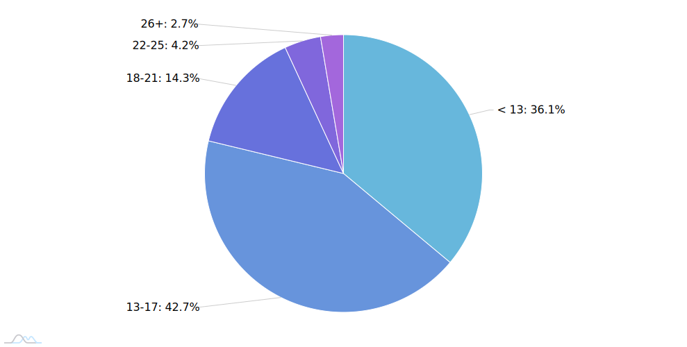
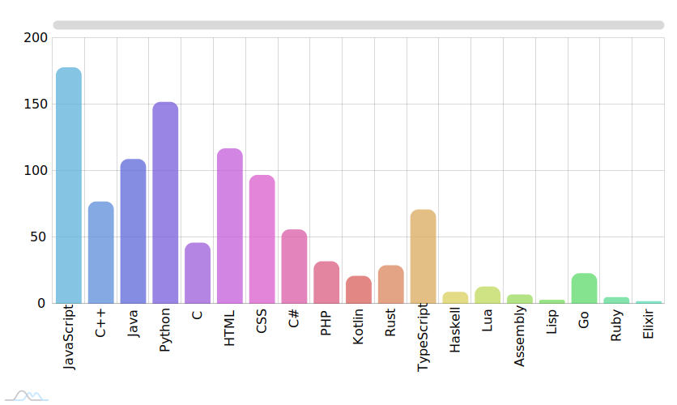

# The Programmer's Hangout 2021 Survey Report

This report details the condensed results of The Programmer's Hangout 2021 Survey. We'll take a look at the most interesting and obscure answers our members submitted.

## About you

### Where are you from?

https://codepen.io/itshobbes/pen/bGBgvoM

### How old are you?

https://codepen.io/itshobbes/pen/YzpOrLL

### What age did you start programming?

https://codepen.io/itshobbes/pen/JjbaMjq

## Education & Employment

### What is your current employment status?

https://codepen.io/itshobbes/pen/GRNXyJq

### Do you code outside of work/studying?

https://codepen.io/itshobbes/pen/oNYPpxN

### What is the highest level of education you have completed?

https://codepen.io/itshobbes/pen/xxRjVmM

### What do you value most in a job?

https://codepen.io/itshobbes/pen/bGBxoYJ

## Programming

### What motivates you to programming?

For the purposes of protecting people's privacy we have posted the raw reasons provided, but we have summarised some of the responses below.

### Which language(s) have you worked with in your studies, during employment, or at home?

https://codepen.io/itshobbes/pen/mdOGpMR

### Which language(s) would you say you are most proficient in?

https://codepen.io/itshobbes/pen/eYBLyEx

### What is your favourite language and why?

Below is an ordered list of TPH's favourite language's alongside the more common reasons that showed up. Languages with fewer than 5 mentions are not shown in this list.

| Language | Count | Reasons |
| --- | --- | --- |
|**Python** | 63 | Simplicity, Easy to pick up, large community|
|**JavaScript** | 59 | Versatility, easy to understand, forgiving|
|**C++** | 42 | Flexibility and low level interaction, fast|
|**Java** | 41 | WORA, job security|
|**TypeScript** | 32 | Type checking, easy to start with, improvement over javascript|
|**Rust** |30 | Borrow checker, less wiggle room to write bad code, performant, good dependency management, ecosystem|
|**C#** | 18 | Clean, easy to read, large ecosystem|
|**C** | 17 | Low level interaction, simple syntax, control over the program|
|**Kotlin** | 14 | Conciseness, interop with java, syntax, java++|
|**Go** | 11 | blend of low and high level|
|**PHP** | 8 | Laravel|
|**Haskell** | 6 |

### What is your least favourite language and why?

Below is an ordered list of TPH's least favourite language's. Languages with fewer than 5 mentions are not shown in this list. 
| Language | Count | Reasons |
| --- | --- | --- |
|**Java** | 52 | Verbose, slow, GC is annoying |
|**JavaScript** | 50 | Easy to write bad code, ecosystem, bad language design |
|**Python** | 41 | Formatting/syntax, speed |
|**PHP** | 43 | For the memes, slow, poor language design |
|**C++** | 23 | Memory management, too complicated |
|**CSS** | 17 | Too complicated |
|**C** | 16 | Memory management |
|**Assembly** | 11 | "Obvious reasons", PITA |
|**HTML** | 8 |
|**C#** | 7 |
|**Lua** | 6 |
|**Go** | 5 |
|**Lisp** | 5 |

### Which lanugage/framework/tool would you like to learn over the next year?

Items where the count was below 5 have not been included in this list.

| Language/framework/tool/tech | Count |
| --- | --- |
|**Rust**| 55 |
|**React**| 40 |
|**C++**| 32 |
|**JavaScript**| 25 |
|**Python**| 23 |
|**Go**| 20 |
|**Java**| 19 |
|**Kotlin**| 18 |
|**Haskell**| 17 |
|**C**| 14 |
|**Elixir**| 14 |
|**TypeScript**| 14 |
|**C#**| 13 |
|**Django**| 10 |
|**VueJS**| 10 |
|**Web dev**| 10 |
|**Angular**| 8 |
|**App dev**| 8 |
|**Express**| 7 |
|**GraphQL**| 7 |
|**Kubernetes**| 7 |
|**Ruby**| 6 |
|**Scala**| 6 |
|**Spring**| 6 |
|**Docker**| 5 |
|**NextJS**| 5 |
|**PHP**| 5 |
|**Swift**| 5 |
|**Tensorflow**| 5 |
|**Unreal Engine**| 5 |

### If you work on personal projects, which of these best describes your approach?

https://codepen.io/itshobbes/pen/JjbaMOj

## Open Source

### How often do you contribute to open source projects?

https://codepen.io/itshobbes/pen/dyOqJdM

### Why do you contribute to open source projects?

**Note:** Only 233 respondents were shown this question. Anyone that said they 'Never' contribute to open source projects **was not** shown this question.

### Which of these statements do you most align with?

**Note:** Only 233 respondents were shown this question. Anyone that said they 'Never' contribute to open source projects **was not** shown this question.

### Would you be more likely to contribute to open source projects if TPH offered more contribution opportunities?

**Note:** Only 233 respondents were shown this question. Anyone that said they 'Never' contribute to open source projects **was not** shown this question.

### What language(s) would you like to see TPH make an open source project in?

**Note:** Only 233 respondents were shown this question. Anyone that said they 'Never' contribute to open source projects **was not** shown this question.

### Do you have any ideas for projects TPH could start?

**Note:** Only 233 respondents were shown this question. Anyone that said they 'Never' contribute to open source projects **was not** shown this question.

### Why have you not contributed to open source projects?

**Note:** Only 144 respondents were shown this question. Anyone that said they 'Never' contribute to open source projects **was** shown this question.

## TPH Feedback

### Which of our network servers are you part of?

### How happy are you with moderation on The Programmer's Hangout? How do you feel about these statements?

### What improvements would you like to suggest to the moderation team?

### What spotlight would you like to see next on TPH?

### What new channel would you like to see on TPH?

### What is your favourite thing about TPH?

### What is your least favourite thing about TPH?

### Do you have any other comments you'd like to give to the moderation team?
