# The Programmer's Hangout 2022 Survey Report

This report details the condensed results of The Programmer's Hangout 2022 Survey. There were a total of 365 responses. Thank you so much to everyone that took the time to respond! We'll take a look at the most interesting and obscure answers our members submitted.

[The data can be found here as a tab separated file.](https://github.com/the-programmers-hangout/Surveys/tree/master/data/2022)

## Contents

- [Reflecting on last year](#reflecting-on-last-year)
- [About You](#about-you)
- [Education & Employment](#education-&-employment)
- [Programming](#programming)
- [Our discord server](#discord)
- [Hardware](#hardware)
- [Open Source](#open-source)
- [TPH Feedback](#tph-feedback)

## Reflecting on last year

## About you

### Where are you from?
[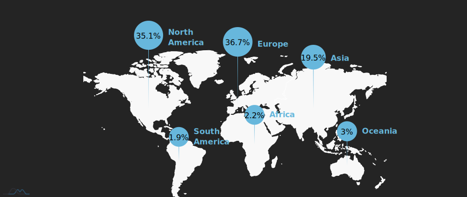](https://codepen.io/itshobbes/pen/NWXPMbE)

Source: https://codepen.io/itshobbes/pen/NWXPMbE

### How old are you?

Source: https://codepen.io/itshobbes/pen/bGaNMaO

### What age did you start programming?

Source: https://codepen.io/itshobbes/pen/rNpavvx

### What gender are you?

Source:https://codepen.io/itshobbes/pen/BaJyxVv

## Education & Employment

### What is your current employment status?
[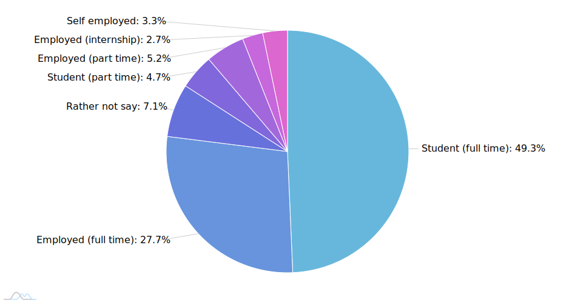](https://codepen.io/itshobbes/pen/BaJyVog)

Source:https://codepen.io/itshobbes/pen/BaJyVog

### Do you code outside of work/studying?

Source: https://codepen.io/itshobbes/pen/XWVJYMa

### What is the highest level of education you have completed?
[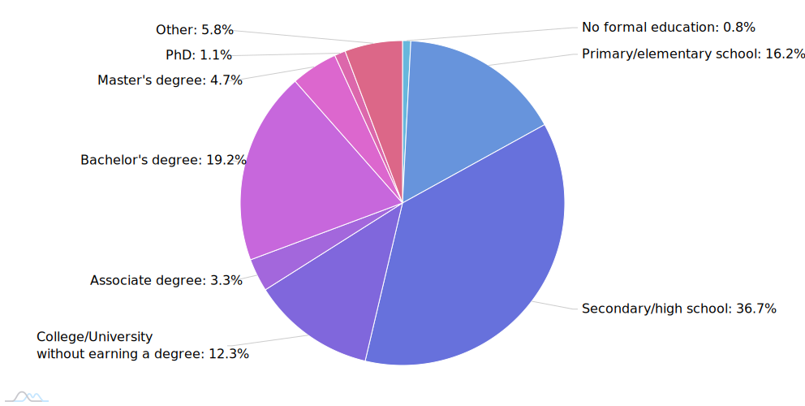](https://codepen.io/itshobbes/pen/GRygGyb)

Source: https://codepen.io/itshobbes/pen/GRygGyb

### What do you value most in a job?

Source: https://codepen.io/itshobbes/pen/xxpbzjz

## Programming

### Motivates you to program?

For the purposes of protecting people's privacy we have redacted the raw reasons provided.

As a summary, some of the most common reasons are listed below.

 - Enjoyment
 - Creativity
 - Problem solving
 - Helping others
 - Money

### Which language(s) have you worked with in your studies, during employment, or at home this year?

Source: https://codepen.io/itshobbes/pen/ExoaeYx

### Which language(s) would you say you are most proficient in?

Source: https://codepen.io/itshobbes/pen/popvOJG

### Which language(s) would you like to try this year?

[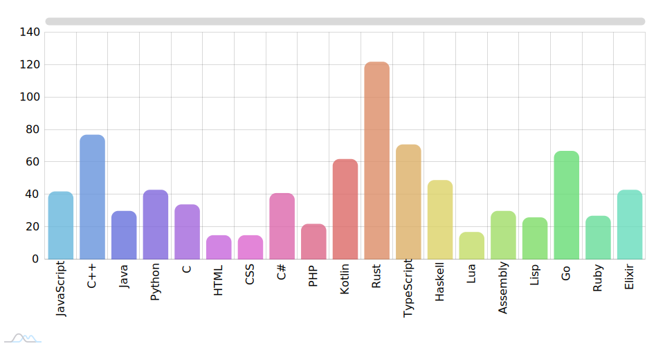](https://codepen.io/itshobbes/pen/jOYEvqX)

Source: https://codepen.io/itshobbes/pen/jOYEvqX

### If you work on personal projects, which of these best describes your approach?

[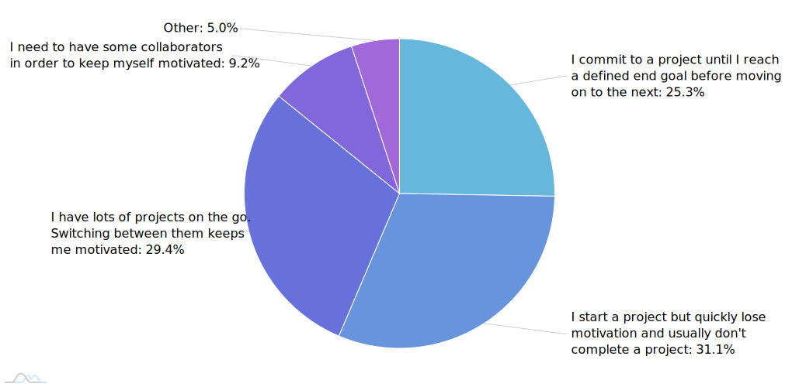](https://codepen.io/itshobbes/pen/xxpbadO)

Source: https://codepen.io/itshobbes/pen/xxpbadO

### What field(s) of programming are you interested in?

Source: https://codepen.io/itshobbes/pen/LYeEJjW

## Discord

### How did you find out about The Programmer's Hangout?

Source: https://codepen.io/itshobbes/pen/gOobdXK

### How long have you been a member of TPH?

Source: https://codepen.io/itshobbes/pen/MWrYqVW

### What do you use TPH for?

[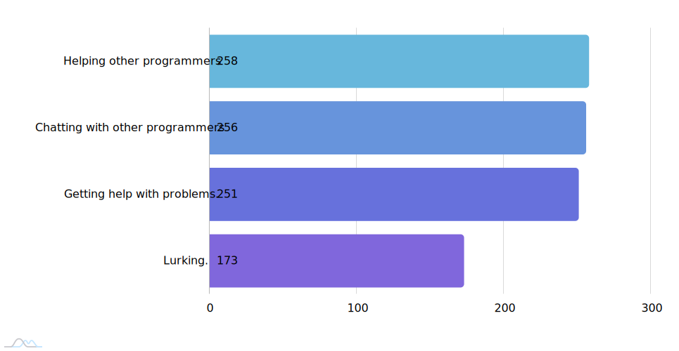](https://codepen.io/itshobbes/pen/popvOKz)

Source: https://codepen.io/itshobbes/pen/popvOKz

### What is the highest activity role you have?

Source: https://codepen.io/itshobbes/pen/XWVJPvp

### Have you ever been shidded?

[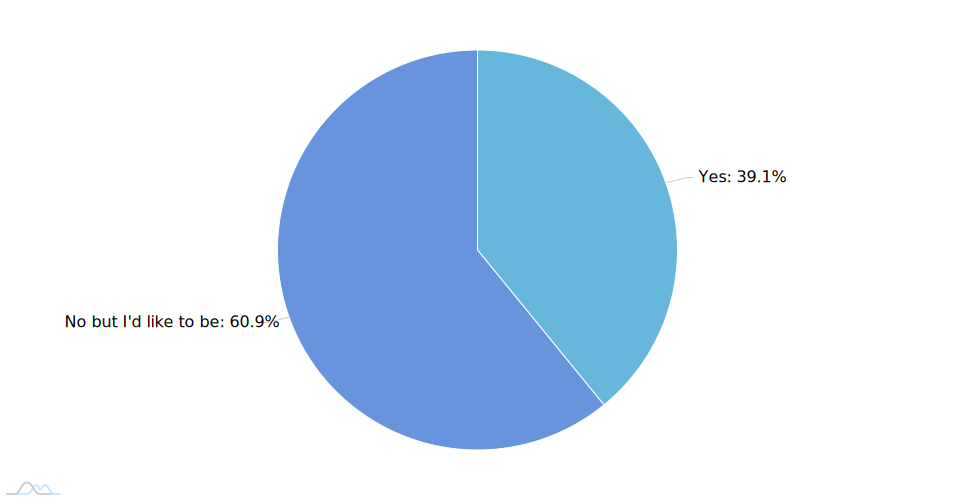](https://codepen.io/itshobbes/pen/jOYEebP)

Source: https://codepen.io/itshobbes/pen/jOYEebP

## Hardware

### What device(s) do you use for programming?

Source: https://codepen.io/itshobbes/pen/WNdbaxb

### Which operating system do you use most often?

[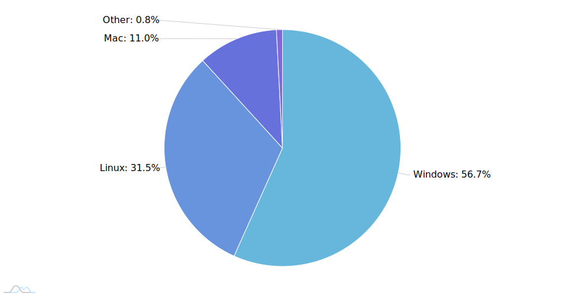](https://codepen.io/itshobbes/pen/yLpyRVa)

Source: https://codepen.io/itshobbes/pen/yLpyRVa

### How many monitors do you use?

[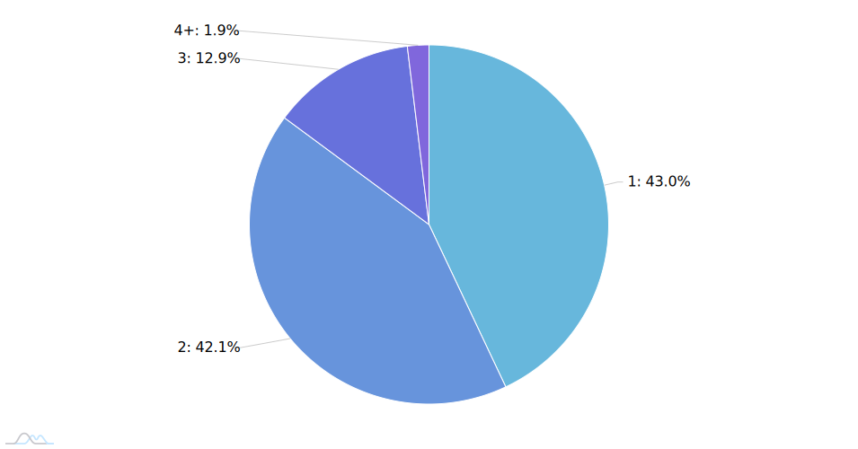](https://codepen.io/itshobbes/pen/zYpxmwE)

Source: https://codepen.io/itshobbes/pen/zYpxmwE

## Open Source

### How often do you contribute to open source projects?

[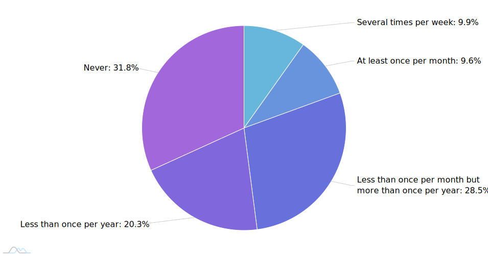](https://codepen.io/itshobbes/pen/rNpaqrp)

Source: https://codepen.io/itshobbes/pen/rNpaqrp

### Why do you contribute to open source projects?

[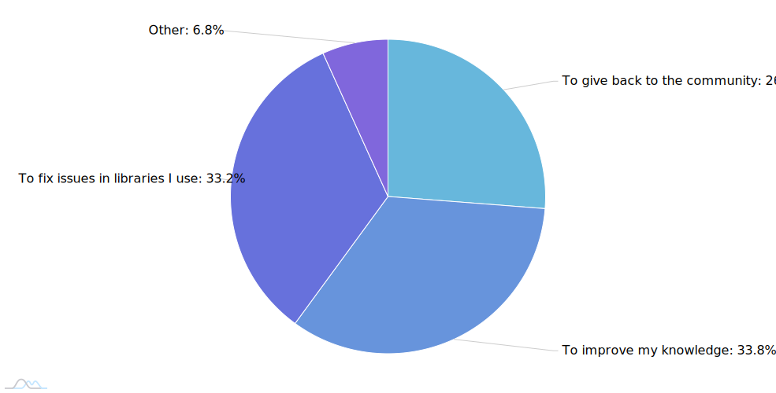](https://codepen.io/itshobbes/pen/MWrYPPv)

Source: https://codepen.io/itshobbes/pen/MWrYPPv

### Which of these statements do you most align with?

Source: https://codepen.io/itshobbes/pen/rNpaqoJ

### Why have you not contributed to open source projects?

[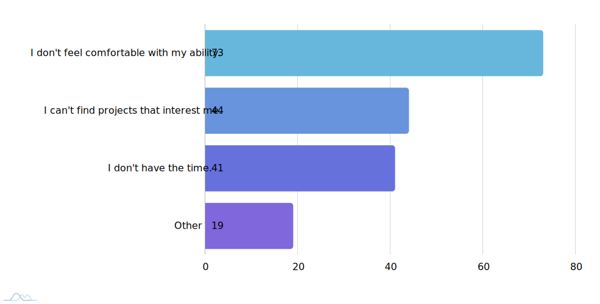](https://codepen.io/itshobbes/pen/ExoadMp)

Source: https://codepen.io/itshobbes/pen/ExoadMp

## TPH Feedback

### How happy are you with moderation on The Programmer's Hangout? How do you feel about these statements?

[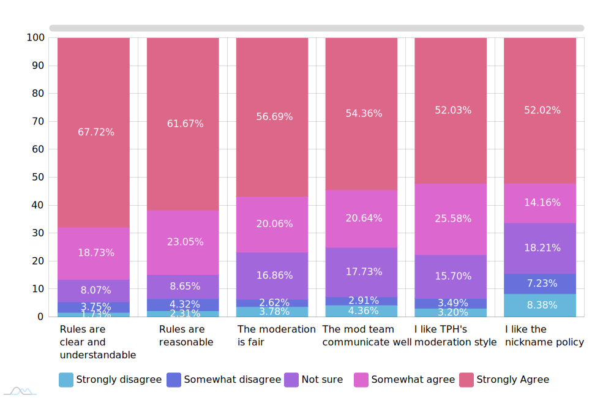](https://codepen.io/itshobbes/pen/MWrYPdO)

Source: https://codepen.io/itshobbes/pen/MWrYPdO

### Have you ever used Threads in TPH?

Source: https://codepen.io/itshobbes/pen/ExoaOYe